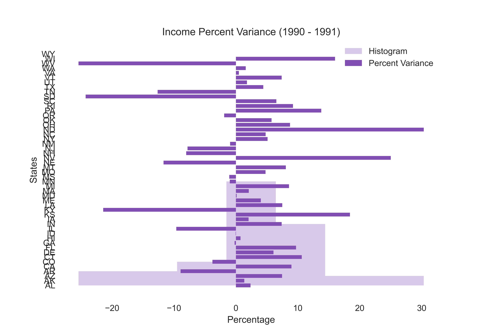

# Solved exercises Basic Econometrics - Gujarati; Porter - 5th Edition

## Chapter 1

***

### Exercise 1.1

Table 1.3 gives data on the Consumer Price Index (CPI) for seven industrialized countries with 1982-1984 = 100 as the
base of the index.

a. From the given data, compute the inflation rate for each country

b. Plot the inflation rate for each country against the time (i.e., use the horizontal axis for time and the vertical
axis for the inflation rate)

c. What broad conclusions can you draw about the inflation experience in the seven countries?

d. Which country's inflation rate seems to be the most variable? Can you offer any explanation?

En lo siguiente se mostrara como se muestran las muestras

